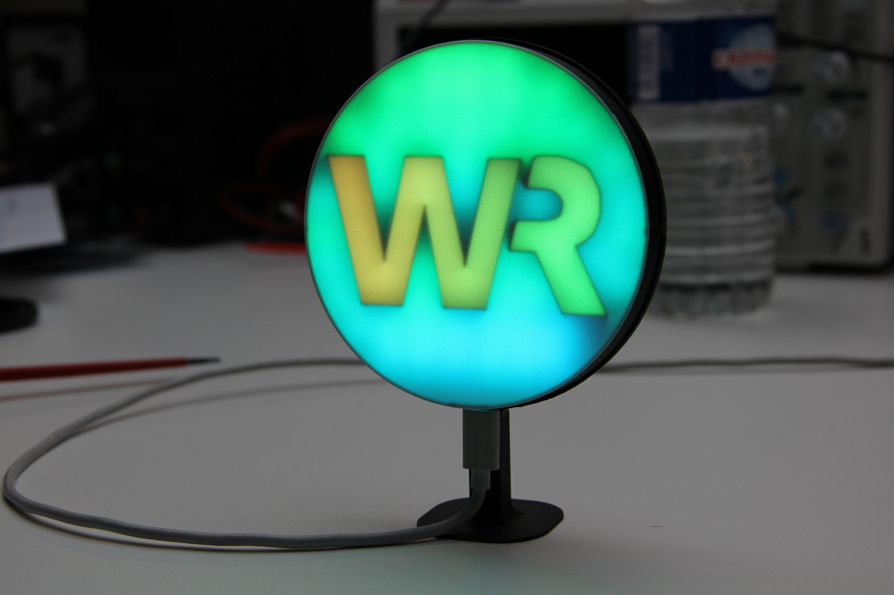
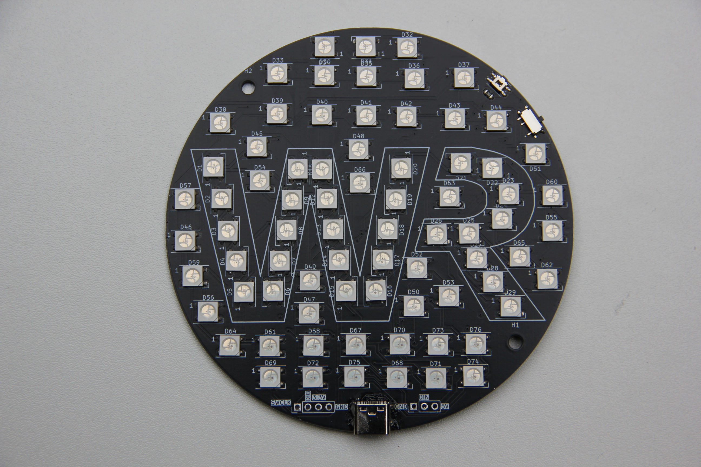
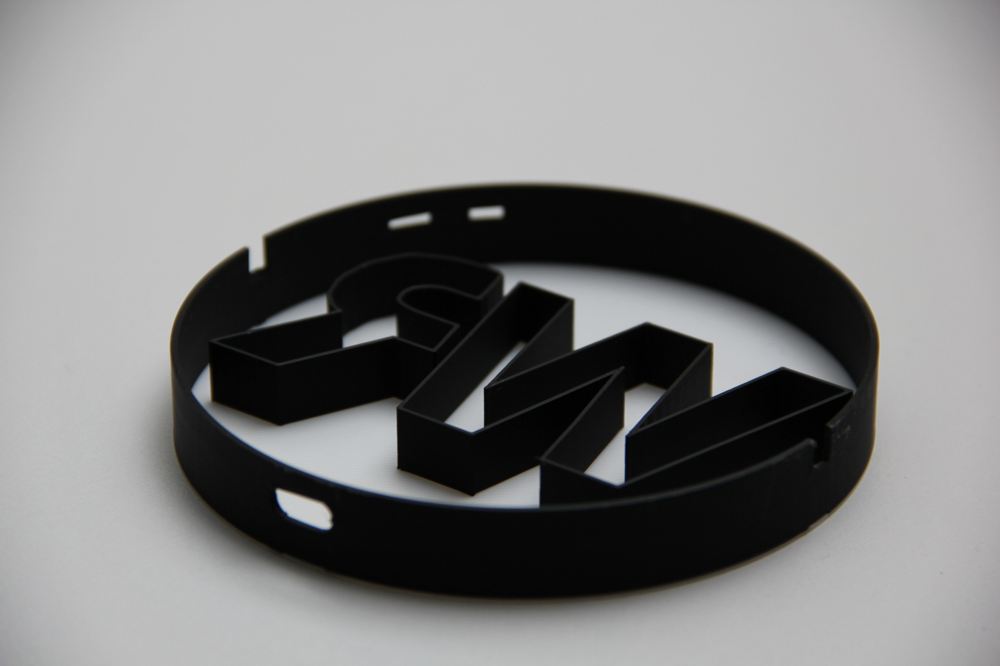
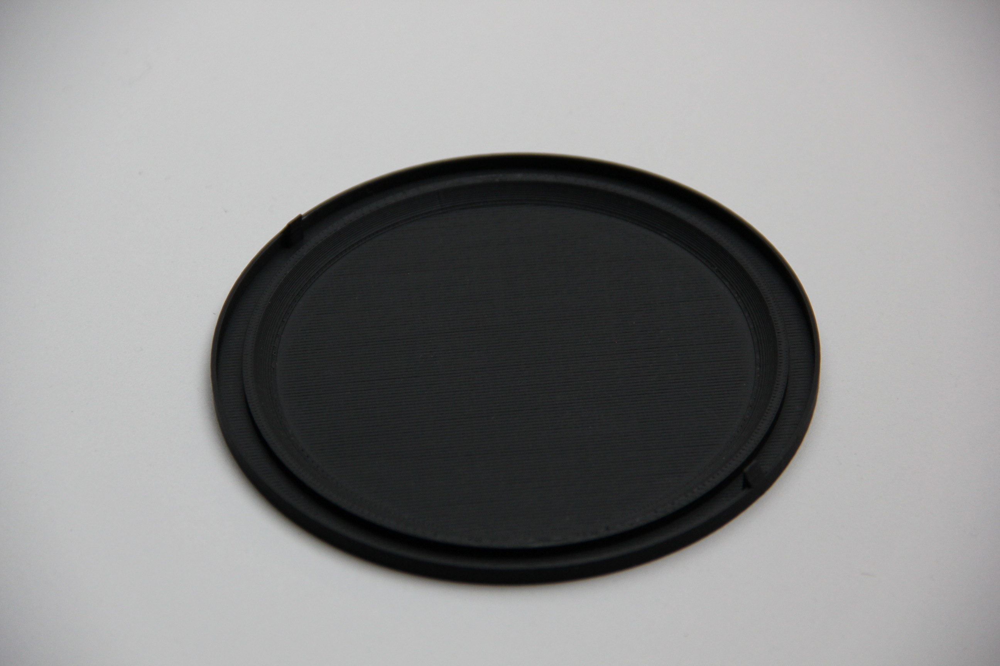

# WRadio LED Display
A custom-built LED display that showcases WRadio's logo with smooth animations and interactive brightness/animation controls via a built-in button.

## Hardware Overview
The design features a straightforward schematic controlled by an STM32F030F4P6TR microcontroller, providing reliable performance in a compact form factor and a cheap price.

## Assembly Instructions
### PCB Assembly
For soldering, refer to the included BOM (Bill of Materials) file. All components are 0805 package size for easy assembly.

### 3D Printed Enclosure
The enclosure consists of two main parts:

**Top Piece:** Requires a multi-color 3D printer or filament switching capability. The first few layers must be printed in white filament to allow proper light diffusion through the logo.

**Bottom Piece:** Choose between the standard base or the angled standing version depending on your preferred display orientation.

### Final Assembly
To assemble the enclosure, simply click the top and bottom pieces together. Make sure the USB-C port on the PCB aligns properly with the corresponding hole in the 3D printed top piece for easy access to power and programming.

## Software
The firmware is developed using STM32CubeIDE and includes:
- Multiple animation modes
- Adjustable brightness levels
- Save system in flash memory
- Button-controlled user interface

## Getting Started
1. Assemble the PCB using the provided BOM
2. 3D print the enclosure parts
3. Insert the PCB into the top piece, ensuring USB-C port alignment
4. Click the top piece into place
5. Flash the firmware using STM32CubeIDE
6. Enjoy your custom WRadio LED display!
